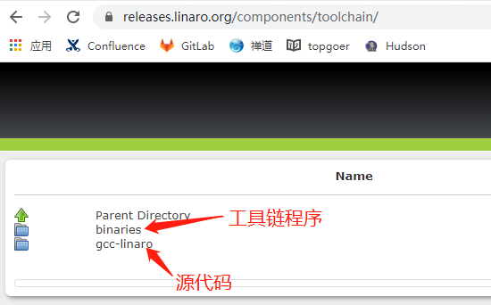
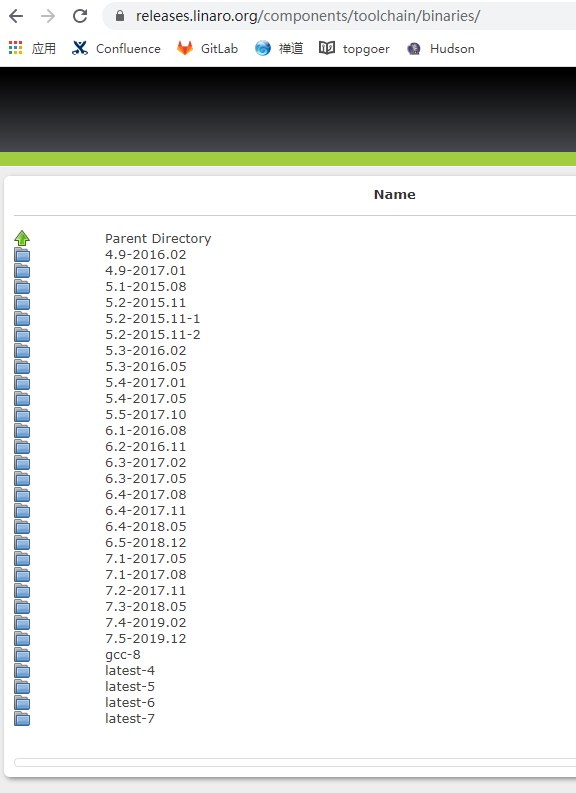
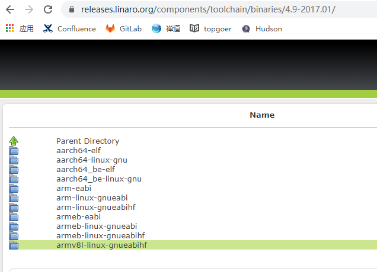
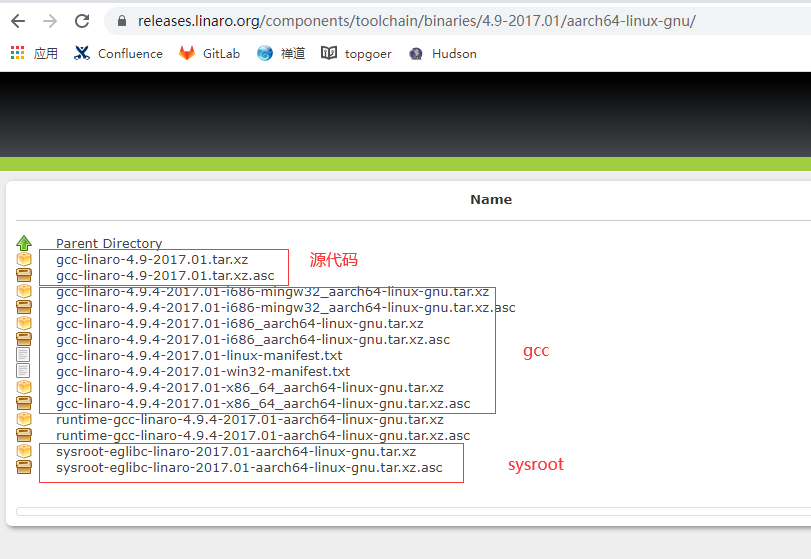

## Linux下arm交叉编译工具链的安装

[TOC]

### 1. 下载交叉编译工具链

下载地址：https://releases.linaro.org/components/toolchain/



进入binaries：



点击一个版本（此处以4.9-2017.01为例）:



选择一个架构（此处以aarch64-linux-gnu为例）：



搭建交叉编译环境只需要下载gcc和sysroot即可。

假如你的linux是64位的，下载这两个文件：

+ [gcc-linaro-4.9.4-2017.01-x86_64_aarch64-linux-gnu.tar.xz](https://releases.linaro.org/components/toolchain/binaries/4.9-2017.01/aarch64-linux-gnu/gcc-linaro-4.9.4-2017.01-x86_64_aarch64-linux-gnu.tar.xz)
+ [ sysroot-eglibc-linaro-2017.01-aarch64-linux-gnu.tar.xz](https://releases.linaro.org/components/toolchain/binaries/4.9-2017.01/aarch64-linux-gnu/sysroot-eglibc-linaro-2017.01-aarch64-linux-gnu.tar.xz)


### 2. 安装工具链

此处将工具链安装到`$HOME/opt/toolchain/aarch64-linux-gnu`目录。

```shell
$ mkdir -p ~/opt/toolchain/aarch64-linux-gnu
$ cd ~/opt/toolchain/aarch64-linux-gnu
$ wget https://releases.linaro.org/components/toolchain/binaries/4.9-2017.01/aarch64-linux-gnu/gcc-linaro-4.9.4-2017.01-x86_64_aarch64-linux-gnu.tar.xz
$ wget https://releases.linaro.org/components/toolchain/binaries/4.9-2017.01/aarch64-linux-gnu/sysroot-eglibc-linaro-2017.01-aarch64-linux-gnu.tar.xz
$ tar zvf aarch64-linux-gnu/gcc-linaro-4.9.4-2017.01-x86_64_aarch64-linux-gnu.tar.xz
$ tar xvf sysroot-eglibc-linaro-2017.01-aarch64-linux-gnu.tar.xz
```


### 3. 使用工具链交叉编译

此处以CMake为例。

创建aarch64-linux-gnu.toolchain.cmake文件：

```cmake
set(CMAKE_SYSTEM_NAME Linux)
set(CMAKE_SYSTEM_PROCESSOR aarch64)

set(CMAKE_SYSROOT /home/test/opt/toolchain/aarch64-linux-gnu/sysroot-eglibc-linaro-2017.01-aarch64-linux-gnu)

set(tools /home/test/opt/toolchain/aarch64-linux-gnu/gcc-linaro-4.9.4-2017.01-x86_64_aarch64-linux-gnu)
set(CMAKE_C_COMPILER ${tools}/bin/aarch64-linux-gnu-gcc)
set(CMAKE_CXX_COMPILER ${tools}/bin/aarch64-linux-gnu-g++)

set(CMAKE_FIND_ROOT_PATH_MODE_PROGRAM NEVER)
set(CMAKE_FIND_ROOT_PATH_MODE_LIBRARY ONLY)
set(CMAKE_FIND_ROOT_PATH_MODE_INCLUDE ONLY)
set(CMAKE_FIND_ROOT_PATH_MODE_PACKAGE ONLY)
```

CMake构建的时候使用该工具链：

```shell
$ mkdir -p build; cd build; rm -rf *
$ cmake .. -DCMAKE_TOOLCHAIN_FILE=path/to/aarch64-linux-gnu.toolchain.cmake
$ cmake --build .
```


